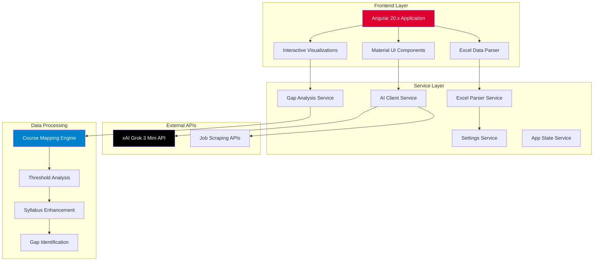
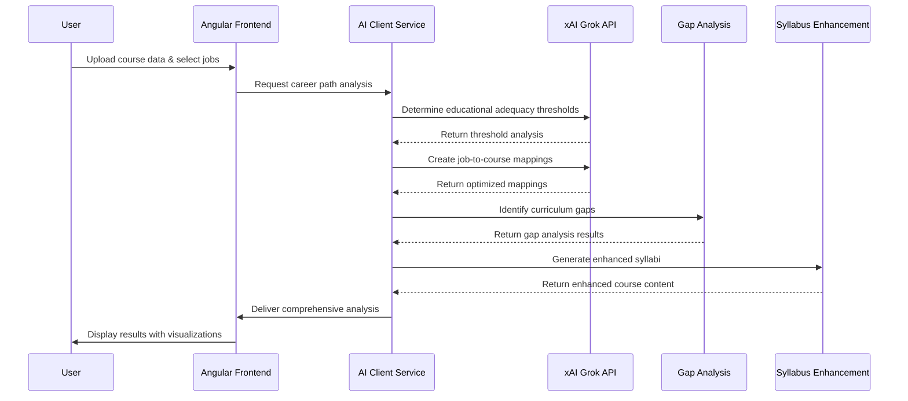

# PathBridger V2.0 🎯

<div align="center">

[](https://angular.io/)
[](https://www.typescriptlang.org/)
[](https://material.angular.io/)
[](https://x.ai/)
[](https://www.utdallas.edu/)

**AI-Powered Career Path Analysis System for Educational Enhancement**

*A sophisticated Angular application that bridges the gap between academic curricula and industry requirements using advanced AI analysis.*

</div>

---

## 🏛️ Academic Attribution

**Institution:** [University of Texas at Dallas](https://www.utdallas.edu/)  
**Supervising Professor:** [Dr. Shrikant Kannan](https://profiles.utdallas.edu/shrikant.kannan)  
**Academic Program:** Independent Study - Semester III  
**Project Type:** Educational Research & Development  

**⚠️ Important Notice:**
> This project is the intellectual property of the University of Texas at Dallas and is developed under academic supervision. It is intended for educational and research purposes only. Reproduction, distribution, or commercial use without explicit permission is prohibited.

---

## 📊 Project Overview

PathBridger V2.0 is an advanced Angular-based application that leverages artificial intelligence to analyze career paths and educational curricula. The system provides intelligent mapping between job requirements and academic courses, identifies skill gaps, and generates enhanced syllabi to better prepare students for their chosen career paths.

### 🎯 Core Objectives

- **Bridge Academic-Industry Gap:** Align educational content with real-world job requirements
- **AI-Driven Analysis:** Utilize xAI Grok API for intelligent career path analysis
- **Curriculum Enhancement:** Generate improved syllabi based on industry demands
- **Data-Driven Insights:** Provide quantitative analysis of educational adequacy
- **User-Friendly Interface:** Deliver complex analysis through intuitive visualizations

---

## 🏗️ System Architecture



### 🔄 AI Analysis Workflow



---

## ✨ Key Features

### 🤖 AI-Powered Analysis
- **Educational Adequacy Thresholds:** AI determines optimal education-to-experience ratios for each job role
- **Intelligent Course Mapping:** Advanced algorithms match courses to career requirements
- **Gap Identification:** Comprehensive analysis of curriculum deficiencies
- **Enhancement Suggestions:** AI-generated recommendations for course improvements

### 📈 Data Processing & Visualization
- **Excel Integration:** Seamless import of course catalogs and syllabi
- **Interactive Charts:** Dynamic visualizations of analysis results
- **Confidence Scoring:** Quantitative assessment of mapping accuracy
- **Comparative Analysis:** Side-by-side curriculum comparisons

### 🎓 Educational Tools
- **Syllabus Enhancement:** AI-generated improved course content
- **Industry Alignment:** Real-time job market data integration
- **Skill Gap Analysis:** Detailed competency gap identification
- **Course Recommendations:** Targeted suggestions for curriculum improvement

### 💻 Technical Excellence
- **Modern Angular Architecture:** Component-based design with TypeScript
- **Material Design System:** Consistent, accessible user interface
- **Reactive Programming:** RxJS-powered data flow management
- **API Integration:** Seamless xAI Grok API connectivity

---

## 🛠️ Technology Stack

<table>
<tr>
<td><strong>Frontend Framework</strong></td>
<td>Angular 20.2.x with TypeScript 5.9.x</td>
</tr>
<tr>
<td><strong>UI Components</strong></td>
<td>Angular Material 20.2.x</td>
</tr>
<tr>
<td><strong>State Management</strong></td>
<td>RxJS with BehaviorSubjects</td>
</tr>
<tr>
<td><strong>AI Integration</strong></td>
<td>xAI Grok 3 Mini API</td>
</tr>
<tr>
<td><strong>Data Processing</strong></td>
<td>XLSX library for Excel parsing</td>
</tr>
<tr>
<td><strong>Visualization</strong></td>
<td>HTML5 Canvas, diff2html</td>
</tr>
<tr>
<td><strong>Export Capabilities</strong></td>
<td>jsPDF, html2canvas</td>
</tr>
<tr>
<td><strong>Development Tools</strong></td>
<td>Angular CLI, Karma, Jasmine</td>
</tr>
</table>

---

## 🚀 Quick Start Guide

### Prerequisites
- Node.js 18+ and npm
- Angular CLI 20.2.x
- xAI API Key (for Grok integration)

### Installation

1. **Clone the repository**
   ```bash
   git clone https://github.com/LakshmanTurlapati/PathBridger.git
   cd PathBridger
   ```

2. **Install dependencies**
   ```bash
   npm install
   ```

3. **Configure API settings**
   - Launch the application
   - Navigate to Settings (gear icon)
   - Enter your xAI Grok API key
   - Configure analysis parameters

4. **Start development server**
   ```bash
   ng serve
   ```
   
   Navigate to `http://localhost:4200/`

### 🔧 Environment Configuration

Create environment configuration files:

```typescript
// src/environments/environment.ts
export const environment = {
  production: false,
  apiUrl: 'https://api.x.ai/v1/chat/completions',
  appName: 'PathBridger V2.0'
};
```

---

## 📖 Usage Guide

### 1. **Data Import**
- Upload Excel files containing course information
- Supported formats: .xlsx, .xls, .csv
- Required columns: course title, optional: code, description

### 2. **Job Selection**
- Choose target career paths from predefined list
- Add custom job titles as needed
- System supports 10+ default professional roles

### 3. **AI Analysis**
- Configure analysis parameters
- Initiate automated career path analysis
- Monitor real-time processing progress

### 4. **Results Interpretation**
- Review course-to-job mappings
- Analyze confidence scores and gap assessments
- Explore enhanced syllabus recommendations

### 5. **Export & Sharing**
- Generate PDF reports
- Export analysis data to CSV
- Share results with stakeholders

---

## 📁 Project Structure

```
src/
├── app/
│   ├── components/           # Reusable UI components
│   │   ├── course-enhancement-viewer/
│   │   ├── job-dialog/
│   │   ├── settings-dialog/
│   │   ├── syllabus-dialog/
│   │   ├── syllabus-diff-viewer/
│   │   └── syllabus-viewer/
│   ├── core/                 # Core services and utilities
│   │   └── services/
│   │       ├── ai-client.service.ts
│   │       ├── gap-analysis.service.ts
│   │       ├── excel-parser.service.ts
│   │       └── settings.service.ts
│   ├── shared/               # Shared interfaces and constants
│   │   ├── interfaces/
│   │   │   ├── data-models.ts
│   │   │   └── syllabus.models.ts
│   │   └── constants/
│   │       └── app-constants.ts
│   └── assets/               # Static resources
├── environments/             # Environment configurations
└── styles.scss              # Global styles
```

---

## 🧪 Development & Testing

### Running Tests
```bash
# Unit tests
ng test

# End-to-end tests
ng e2e

# Test coverage
ng test --coverage
```

### Building for Production
```bash
# Production build
ng build --configuration production

# Analyze bundle size
ng build --stats-json
npx webpack-bundle-analyzer dist/V2/stats.json
```

### Code Quality
```bash
# Linting
ng lint

# Format code
npm run prettier
```

---

## 📊 API Integration

### xAI Grok API Configuration

The system integrates with xAI's Grok 3 Mini model for advanced AI analysis:

```typescript
const grokConfig = {
  model: 'grok-3-mini',
  temperature: 0.3,
  max_tokens: 2048,
  reasoning_effort: 'high'
};
```

**API Capabilities:**
- Educational threshold determination
- Course-to-job mapping optimization
- Syllabus enhancement generation
- Industry skills analysis

---

## 🔬 Research Applications

### Academic Use Cases

1. **Curriculum Design:** Optimize course content based on industry requirements
2. **Educational Assessment:** Quantify curriculum effectiveness
3. **Career Guidance:** Provide data-driven career counseling
4. **Industry Collaboration:** Bridge academia-industry communication gaps

### Research Methodologies

- **Quantitative Analysis:** Statistical assessment of educational adequacy
- **Machine Learning:** AI-driven pattern recognition in career pathways
- **Data Mining:** Extraction of insights from job market trends
- **Comparative Studies:** Cross-institutional curriculum analysis

---

## 🤝 Contributing

As this is an academic project under university supervision, contributions are managed through the academic institution. For research collaboration inquiries, please contact:

**Dr. Shrikant Kannan**  
University of Texas at Dallas  
[shrikant.kannan@utdallas.edu](mailto:shrikant.kannan@utdallas.edu)

---

## 📄 License & Copyright

**Copyright © 2024 University of Texas at Dallas**

This project is developed for educational and research purposes under academic supervision. All rights reserved. No part of this software may be reproduced, distributed, or transmitted in any form or by any means without the prior written permission of the University of Texas at Dallas.

For academic collaboration or research partnership inquiries, please contact the supervising faculty.

---

## 🔗 Related Resources

- [Angular Documentation](https://angular.dev/)
- [Material Design System](https://material.angular.io/)
- [xAI API Documentation](https://docs.x.ai/)
- [University of Texas at Dallas](https://www.utdallas.edu/)
- [Professor Shrikant Kannan's Profile](https://profiles.utdallas.edu/shrikant.kannan)

---

<div align="center">

**Developed with 💻 at University of Texas at Dallas**

*Advancing education through AI-powered analysis*

[](https://www.utdallas.edu/)

</div>
